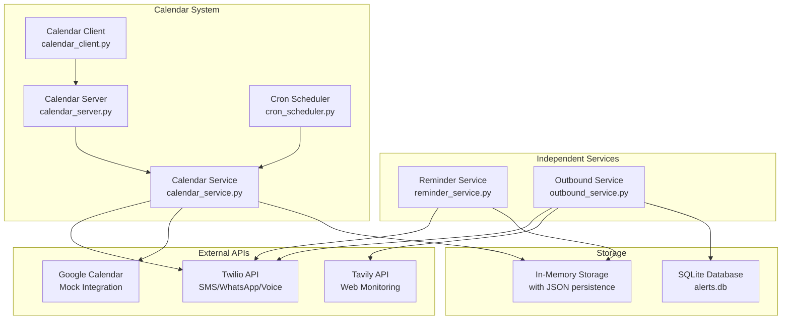

# Maya Agent System - Communication & Automation Platform

A comprehensive communication and automation platform built with Python FastAPI that handles three core functionalities: user reminders, outbound alerts, and automated event scheduling with notification systems.

## 🏗️ High-Level Architecture

```
Maya Agent System
├── 📱 User Reminder System (reminder_service.py) - Independent Service
├── 🔔 Outbound Alert System (outbound_service.py) - Independent Service
└── 📅 Calendar Event System (calendar_service.py) - Main Service with API
    ├── FastAPI Server (calendar_server.py)
    ├── Client Testing (calendar_client.py)
    └── Cron Scheduler (cron_scheduler.py)
```

## 📋 System Overview

### 🔧 Independent Services

#### 1. User Reminder System (`reminder_service.py`)

**Objective:** Personal reminder system with background cron job integration via Twilio/WhatsApp

**Key Features:**

- ⏰ **Asynchronous Reminder Capture & Storage**: Accept reminder requests and store them with scheduling details
- 🔄 **Cron-based Background Processing**: Automated reminder delivery using APScheduler
- 🌍 **Timezone Management**: Handle user timezones for accurate reminder delivery
- 📱 **Multi-channel Delivery**: SMS and WhatsApp support via Twilio
- 🔕 **Opt-out Management**: User preference management for notifications
- 📊 **Memory-based Storage**: Mock in-memory database with file persistence
- 🔁 **Recurring Reminders**: Daily, weekly, monthly recurrence patterns

**Technical Stack:**

```python
- APScheduler (AsyncIOScheduler) - Background job processing
- Twilio Client - SMS/WhatsApp delivery
- Dataclasses - Data modeling
- JSON persistence - Mock database storage
```

#### 2. Outbound Alert System (`outbound_service.py`)

**Objective:** Proactive monitoring and alerting for price drops and job opportunities via SMS/calls

**Key Features:**

- 🔍 **Async Polling & Monitoring**: Continuous monitoring using Tavily API for price drops and job matches
- 🎯 **Preference-based Filtering**: User-specific alert preferences (keywords, thresholds, notification methods)
- 📞 **Multi-modal Notifications**: SMS and voice call support through Twilio
- 🔄 **Deduplication**: Prevent spam by tracking sent alerts
- 👥 **Opt-in Management**: User consent and preference management
- ⏰ **Smart Scheduling**: Quiet hours and rate limiting
- 💾 **SQLite Database**: Persistent storage for user preferences and alert history

**Alert Types:**

- 💰 **Price Drop Alerts**: Monitor product prices and notify on significant drops
- 💼 **Job Match Alerts**: Career opportunity matching based on user keywords
- 💳 **Transaction Alerts**: Financial transaction notifications

**Technical Stack:**

```python
- Tavily API - Web search and monitoring
- Twilio Client - SMS/Voice delivery
- SQLite - Database storage
- AsyncIO - Concurrent processing
- Loguru - Advanced logging
```

### 🎯 Main Calendar Service System

#### 3. Automated Event Scheduler (`calendar_service.py`)

**Objective:** Full-featured event scheduling system with Google Calendar integration and automated notifications

**Key Features:**

- 📅 **Event Management**: Create, update, delete events with comprehensive details
- 🔗 **Google Calendar Mock Integration**: Simulate calendar API integration
- 🔔 **Automated Reminder System**: Cron-based reminder delivery before events
- 📱 **Multi-channel Notifications**: SMS/WhatsApp confirmations and reminders
- 💾 **In-memory Storage**: Mock database with pre-loaded demo events
- ⚡ **Async Processing**: Non-blocking event creation and notification handling
- 🛡️ **Error Handling**: Comprehensive error management and logging

## 🚀 System Components

### Core Services Architecture



## 📁 File Structure & Responsibilities

```
root/
├── 🔧 Independent Services
│   ├── app/
│   │   ├── reminder_service.py      # Personal reminder management
│   │   └── outbound_service.py      # Alert monitoring & delivery
│
├── 📅 Calendar System
│   ├── app/
│   │   └── calendar_service.py      # Event scheduling core service
│   ├── calendar_server.py           # FastAPI REST API server
│   ├── calendar_client.py           # Testing client
│   └── utils/
│       └── cron_scheduler.py        # Background reminder processor
│
├── 📊 Shared Components
│   ├── models/
│   │   └── models.py                # Data models & schemas
│   └── config/
│       └── config.py                # Configuration management
```

## ⚙️ Technical Implementation

### Reminder Service Flow

```python
# 1. User creates reminder
reminder = await reminder_service.create_reminder(
    user_id="user123",
    message="Take medication",
    scheduled_time=datetime(2025, 8, 22, 14, 30),
    recurrence=RecurrenceType.DAILY
)

# 2. Cron job processes pending reminders
scheduler.add_job(
    process_pending_reminders,
    IntervalTrigger(minutes=1)
)

# 3. SMS/WhatsApp delivery via Twilio
await twilio.send_sms(user.phone_number, reminder.message)
```

### Outbound Alert Flow

```python
# 1. Continuous monitoring
await tavily_client.search_price_drops(
    keywords=["laptop", "smartphone"],
    threshold=15.0
)

# 2. Filter by user preferences
matching_alerts = filter_by_user_preferences(results, user_prefs)

# 3. Send notifications respecting quiet hours
if not is_quiet_hours(user_pref):
    await send_alert(alert, user_pref)
```

### Calendar Event Flow

```python
# 1. Event creation via REST API
POST /events
{
    "title": "Team Meeting",
    "start_time": "2025-08-22T14:00:00",
    "attendee_phone": "+1234567890",
    "reminder_minutes": 15
}

# 2. Mock Google Calendar integration
calendar_id = await google_calendar.create_event(event_data)

# 3. Automated reminder via cron
cron_scheduler.add_job(send_reminders, IntervalTrigger(minutes=1))
```

## 🔧 Environment Setup

Required environment variables:

```bash
# Twilio Configuration
TWILIO_ACCOUNT_SID=your_account_sid
TWILIO_AUTH_TOKEN=your_auth_token
TWILIO_NUMBER=your_twilio_number
TWILIO_TARGET_NUMBER=your_target_number

# Tavily API (for outbound alerts)
TAVILY_API_KEY=your_tavily_api_key
```

## 🚀 Getting Started

1. **Install Dependencies:**

   ```bash
   pip install -r requirements.txt
   ```

2. **Configure Environment:**

   ```bash
   cp .env.example .env
   # Add your API credentials
   ```

3. **Run Services:**

   **Reminder Service (Independent):**

   ```bash
   python app/reminder_service.py
   ```

   **Outbound Alert Service (Independent):**

   ```bash
   python app/outbound_service.py
   ```

   **Calendar System (Main Service):**

   ```bash
   python calendar_server.py
   ```

4. **Test Calendar API:**
   ```bash
   python calendar_client.py
   ```

## 🎯 Key Features Summary

| Service              | Primary Function                        | Integration                   | Storage         |
| -------------------- | --------------------------------------- | ----------------------------- | --------------- |
| **Reminder Service** | Personal reminders with cron scheduling | Twilio SMS/WhatsApp           | JSON + Memory   |
| **Outbound Service** | Proactive monitoring & alerting         | Tavily + Twilio               | SQLite Database |
| **Calendar Service** | Event scheduling & automated reminders  | Google Calendar Mock + Twilio | Memory Store    |

## 🔮 Architecture Benefits

- **🔄 Modular Design**: Independent services can be deployed separately
- **⚡ Async Processing**: Non-blocking operations for better performance
- **📱 Multi-channel Communications**: SMS, WhatsApp, and voice support
- **🛡️ Error Resilience**: Comprehensive error handling and logging
- **🔧 Mock Integrations**: Easy testing without external dependencies
- **📊 Flexible Storage**: Multiple storage strategies based on use case

---

_This system demonstrates a scalable approach to communication automation, combining personal productivity tools with proactive monitoring capabilities._
